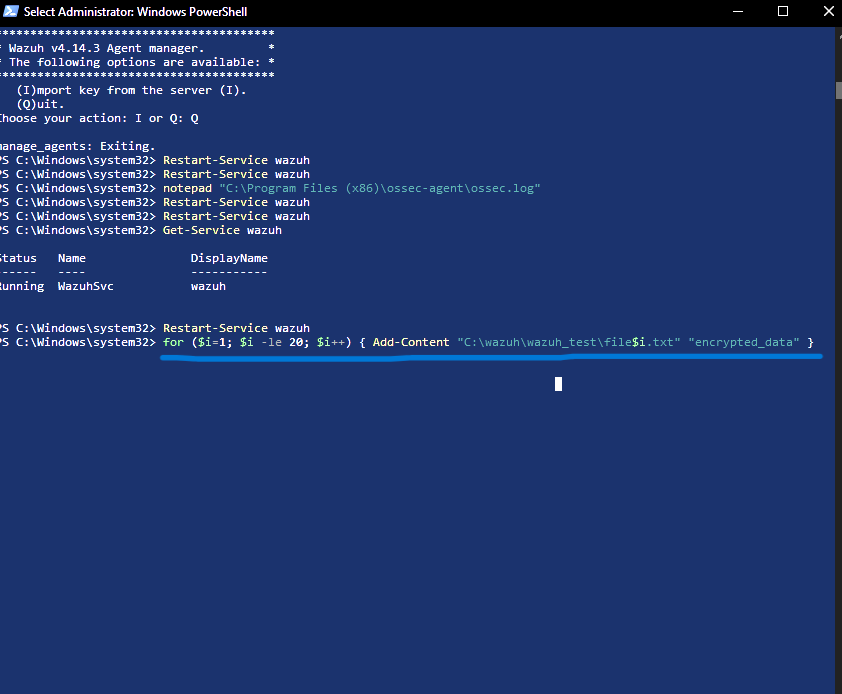
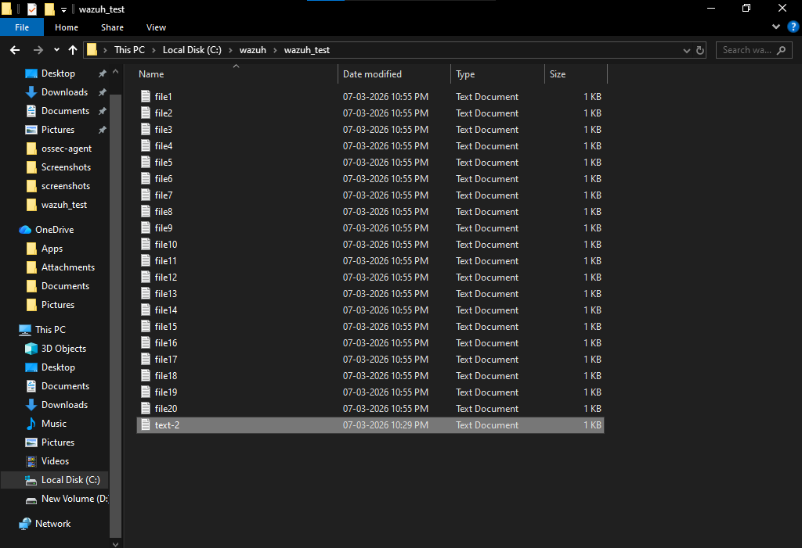
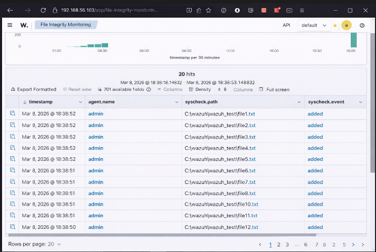
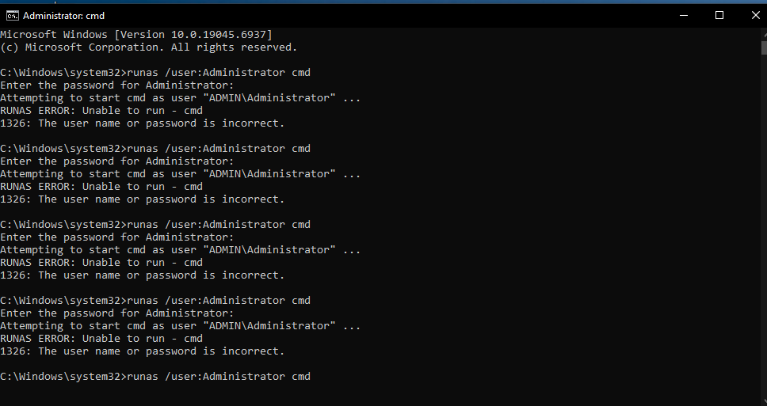
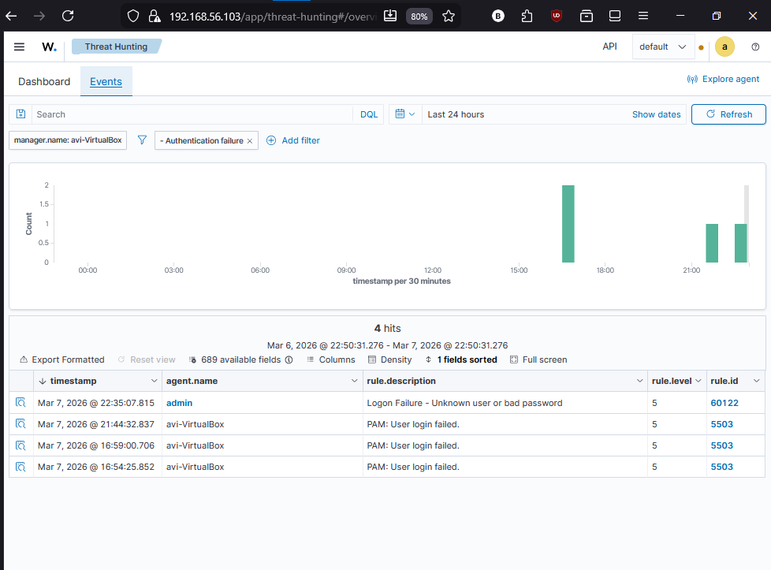
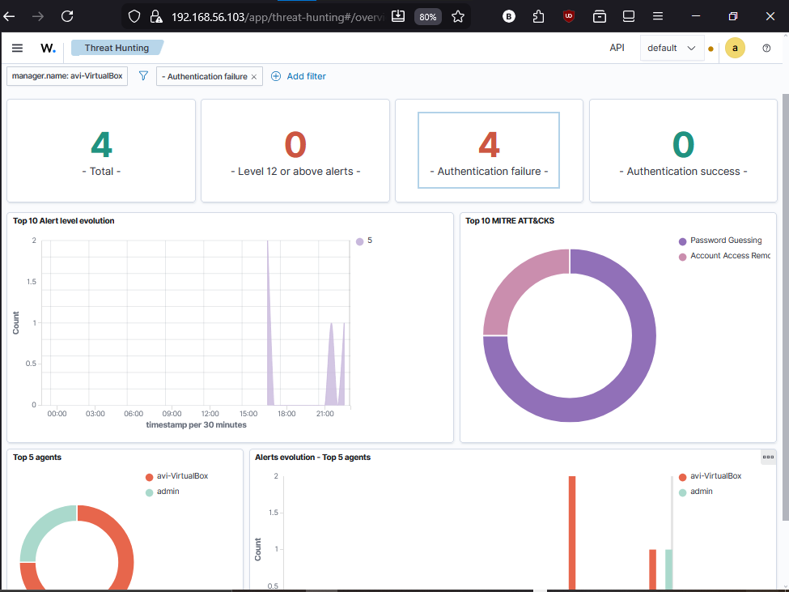

# Wazuh SIEM Home Lab – Security Monitoring and Detection

## Overview

This project demonstrates how a **Security Information and Event Management (SIEM)** system can detect suspicious activity on monitored endpoints.

A Wazuh SIEM environment was deployed in a virtual lab to simulate and analyze security events.
Two different attack scenarios were performed and investigated:

1. Suspicious file creation activity (ransomware-like behavior)
2. Authentication failure attempts (password guessing simulation)

The Wazuh SIEM successfully detected both activities using security monitoring and log analysis.

---

## Lab Environment

| Component                 | Description                                       |
| ------------------------- | ------------------------------------------------- |
| Wazuh Manager             | SIEM server running on Ubuntu                     |
| Windows Endpoint          | Monitored machine running the Wazuh agent         |
| File Integrity Monitoring | Detects file creation, modification, and deletion |
| Threat Hunting            | Used to analyze authentication events             |

---

## Attack Scenario 1 – Suspicious File Activity

A PowerShell script was executed to automatically create multiple files inside a monitored directory:

```id="4hgrul"
C:\wazuh\wazuh_test
```

Rapid file creation like this can resemble **ransomware behavior** where malware modifies many files quickly.

### Attack Simulation



### Files Created



### Detection in Wazuh

The File Integrity Monitoring (FIM) module detected these file creation events.



🔎 **Detailed investigation report:**
[View File Integrity Monitoring Investigation](https://github.com/imheretosteal/wazuh-siem-lab-temp/blob/830ece5dab02b268ea5b75e95fe68c2becfb1b02/investigation/%20file-creation-investigation.md)

---

## Attack Scenario 2 – Authentication Failure Activity

To simulate unauthorized access attempts, multiple login attempts were performed using incorrect credentials.

This behavior mimics a **password guessing or brute-force attack**.

### Failed Login Attempts



### Authentication Logs in Wazuh



### Threat Hunting Dashboard



🔎 **Detailed investigation report:**
[View Authentication Investigation](https://github.com/imheretosteal/wazuh-siem-lab-temp/blob/e9482a77217752cfef9876677c8d029d331d9fbc/investigation/authentication-bruteforce-investigation.md)

---

## Skills Demonstrated

* SIEM deployment and configuration
* Security monitoring using Wazuh
* File Integrity Monitoring (FIM)
* Log analysis and threat hunting
* Attack simulation using PowerShell
* Authentication event analysis

---

## Tools Used

* Wazuh SIEM
* Ubuntu Linux
* Windows Endpoint
* PowerShell
* VirtualBox

---

## Key Takeaway

This lab demonstrates how SIEM platforms like **Wazuh** can detect suspicious behavior such as abnormal file activity and repeated authentication failures.

These detection capabilities are critical for identifying **potential ransomware activity and unauthorized access attempts** in real-world security operations.
